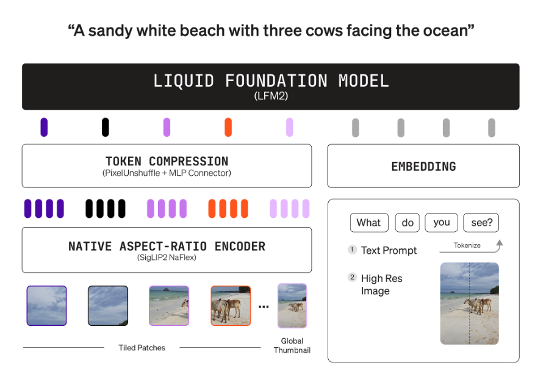
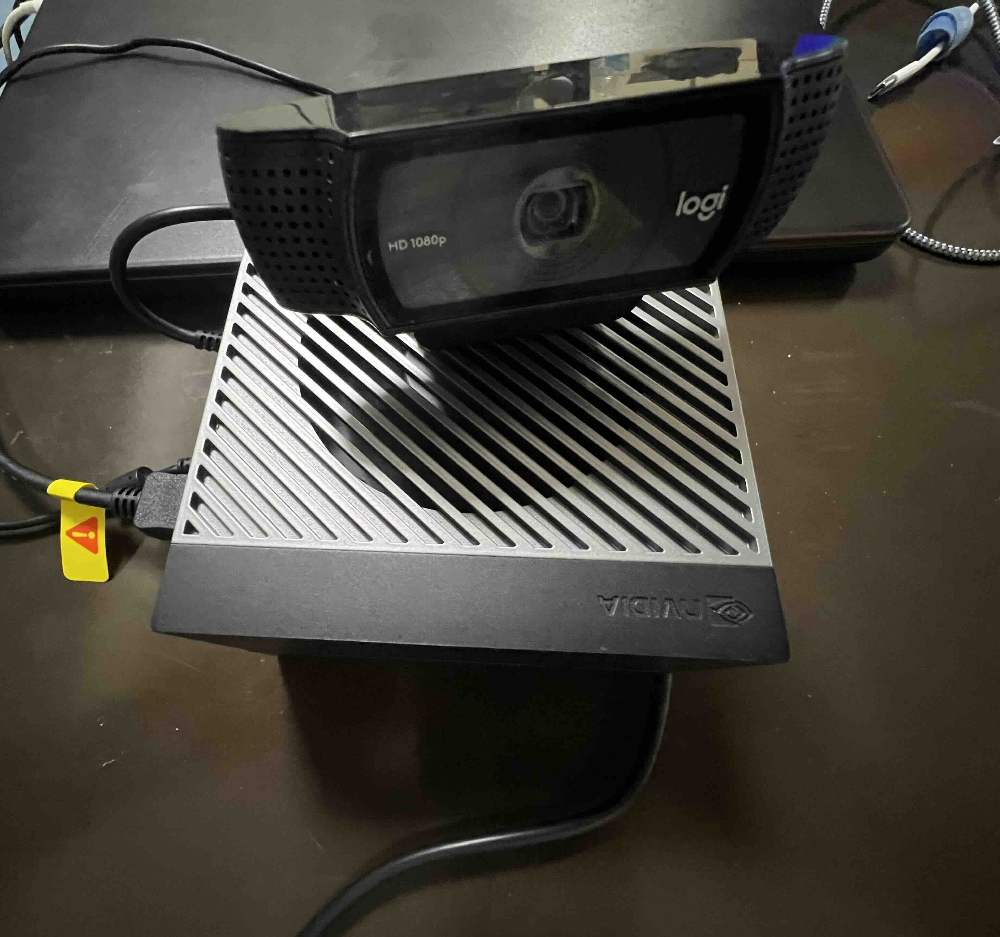

# Edge Computing Workshop Japan 2025


- Edge Computing Slide - [Link](https://docs.google.com/presentation/d/17RwHiok1fHg5p3La4Y7FH_nfN_jkB-7isJlzI7WQRE8/edit?usp=sharing)

## Deployment of Edge Devices( e.g Jetson Orin, Jetson AGX and Macbook)

### Prerequisites

- Ensure you're using Python 3.10 - 3.13

### Setup Virtual Environment

- Create a python virtual environment

```
python3 -m venv edge-env
```

- Activate the environment

```
(edge-env)python3 camera_infer_h5.py -m models/model.h5 -l labels.txt --width 320 --height 320 
```

- Install the requirements

```
pip install -r requirements.txt
```

#### Deployment of Image Classification Models Edge Devices and Laptop

- Change the directory to `image-classification`

```
cd image-classification
```

- Inference on live video stream from camera (Unoptimized Model - float 32):

Unzip the model:

```
unzip models/ei-edge-computing-workshop-2025-image-classification-japan-final-classifier-keras-h5-model-model.5.zip
```

```
(edge-env)python3 python3 camera_infer_h5.py -m models/model.h5 -l labels.txt --width 320 --height 320
```

- Inference on live video stream from camera (Optimized Model - int-8):

```
python3 camera_infer_tflite.py --model models/ei-v2-classification-classifier-tensorflow-lite-int8-quantized-model.3.lite --labels labels.txt --camera 0 --top_k 3
```

Quit the live stream by pressing `q` or `ctrl + c`:

```

^CTraceback (most recent call last):
  File "/Users/george/Documents/github/edge-computing-workshop-kigali/image-classification/camera_infer_tflite.py", line 162, in <module>
    main()
  File "/Users/george/Documents/github/edge-computing-workshop-kigali/image-classification/camera_infer_tflite.py", line 154, in main
    key = cv2.waitKey(1) & 0xFF
          ^^^^^^^^^^^^^^
KeyboardInterrupt
^C
```

- Inference on images saved on disk:

```
python3 batch-inference.py --model models/ei-v2-classification-classifier-tensorflow-lite-float32-model.3.lite --labels labels.txt --images_dir ./sample-directory
```

Output:

```

blue-bear.6cbjdlbp.jpg — inference 3.5 ms
  blue-bear: 0.9999
  brown-bear: 0.0001
  pink-bear: 0.0000

blue-bear.6cbjdlhq.jpg — inference 3.5 ms
  blue-bear: 0.9968
  brown-bear: 0.0032
  pink-bear: 0.0000

blue-bear.6cbjds5a.jpg — inference 3.7 ms
  blue-bear: 1.0000
  brown-bear: 0.0000
  pink-bear: 0.0000

brown-bear.6cbj601n.jpg — inference 3.6 ms
  brown-bear: 0.9868
  pink-bear: 0.0113
  blue-bear: 0.0019

brown-bear.6cbj675p.jpg — inference 3.6 ms
  brown-bear: 0.9990
  blue-bear: 0.0009
  pink-bear: 0.0001

brown-bear.6cbj67eq.jpg — inference 3.6 ms
  brown-bear: 0.9994
  blue-bear: 0.0006
  pink-bear: 0.0000

pink-bear.6cbjf4u7.jpg — inference 3.6 ms
  pink-bear: 0.9968
  brown-bear: 0.0030
  blue-bear: 0.0002

pink-bear.6cbjf5o2.jpg — inference 3.6 ms
  pink-bear: 0.9952
  brown-bear: 0.0042
  blue-bear: 0.0006

pink-bear.6cbjhcbb.jpg — inference 3.6 ms
  pink-bear: 0.9988
  blue-bear: 0.0006
  brown-bear: 0.0005

pink-bear.6cbjhcum.jpg — inference 3.6 ms
  pink-bear: 0.9983
  blue-bear: 0.0009
  brown-bear: 0.0008

pink-bear.6cbjhpu9.jpg — inference 3.6 ms
  pink-bear: 0.9993
  brown-bear: 0.0007
  blue-bear: 0.0000
```

#### Deployment of Object Detection Models Edge Devices and Laptop

- Change the directory to `object-detection`
- Inference on live video stream from camera (Unoptimized Model - float 32):

```
python3 real-time-inference.py 
```

- Inference on live video stream from camera (Optimized Model - int-8):

```
python3 real-time-inference-tflite.py
```

### Working with Visual Language Models(Liquid AI - VLM)



- Prompting Visual Language Model (VLM) Colab - [VLM Prompt Engineering](https://colab.research.google.com/drive/1G3I3BxZzfv8oOc3qpJL-4kL95WXzXuDu?usp=sharing)
- Running it locally on your laptop - [Link](https://github.com/gigwegbe/edge-computing-workshop-japan/blob/main/vision-language-model/deployment-script.py)

#### Deploying VLM on Edge Device



- Change directory into `visual-language-model`

```
  python3 deployment-script.py
```

```
--- Model Response ---
{
  "objects": {
    "bear_1": {
      "colors": ["brown"],
      "description": "A plush bear with a tag, lying on its back."
    },
    "bear_2": {
      "colors": ["white", "blue", "yellow"],
      "description": "A plush bear wearing a blue outfit with yellow accents, holding a drum."
    },
    "bear_3": {
      "colors": ["pink", "white", "red", "yellow"],
      "description": "A plush bear wearing a pink outfit with white and red accents, holding a yellow star-shaped accessory."
    }
  }
}
```
